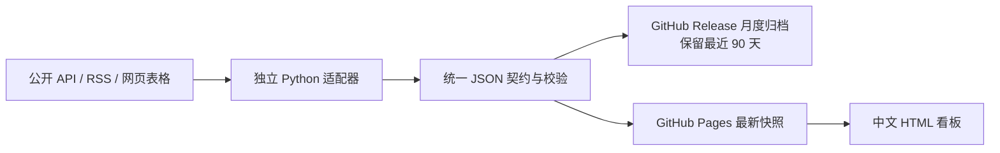

# AI 产业观察：免费自动化看板

这是一个中文个人投研看板。采集器在 GitHub Actions 中运行，数据以 JSON 和压缩快照保存，GitHub Pages 只负责展示，因此电脑关机后网址仍可访问。公开网址：<https://liyanqiao0106-max.github.io/hf-trend-snapshots/>。

## 运行架构



- 每天上海时间 12:00 采集新闻、模型报价、GPU 报价和存储价格，周末照常。
- 每周二 12:20 定稿 OpenRouter Token 用量、Hugging Face 和 GitHub 项目数据。
- 页面打开或点击刷新时读取最近一次成功快照；浏览器不会直接访问需要密钥的 API。
- 单个来源失败时保留最近成功数据并显示 `partial` 或 `stale`，不影响其他栏目更新。
- 仅使用公开仓库、标准 Actions runner、Pages、Releases 和免费数据源，不设置付费兜底。

## 栏目与数据口径

| 栏目 | 数据源与说明 |
|---|---|
| 产业新闻 | 国内外公开 RSS；显示中文标题、短摘要和原文链接。国际内容使用 MyMemory 免费翻译，24 小时最多 3000 字符，失败时明确提示 |
| Token 自然周 | OpenRouter 官方 Data API；按 UTC 周一至周日生成完整周、进行中周和预览周，不能代表全行业 |
| 模型 API 价格 | OpenRouter 模型目录；输入、输出、缓存价格统一为 USD/百万 Token，缺失值保持为空 |
| GPU 云报价 | Azure Retail Prices；可选接入 RunPod、Vast.ai 免费 API。实例总价与每 GPU 时价分开，On-demand 与 Spot 分开 |
| 存储硬件价格 | DRAMeXchange 免费公开当日表格中的 DDR4/DDR5、DRAM 模组、NAND、TLC Wafer、GDDR5/GDDR6 与 SSD；BLS 存储设备 PPI；每日快照形成自有历史趋势 |
| HBM 租赁代理 | 用含 HBM 的 GPU 云实例价除以 HBM 容量，只是包含计算、CPU、RAM 和平台成本的代理指标，不冒充 HBM 现货价 |
| Hugging Face | 全量候选池与分层展示，使用约 7 日和 14 日快照比较 |
| GitHub AI 项目 | GitHub Trending 候选池、AI/ML topics、官方仓库和 Release 信息；总 Stars 与周净变化分列 |

存储板块不包含新闻。公开来源没有可持续、免费的独立 HBM 现货 API，因此看板明确展示租赁代理。GDDR4 已不是公开表格中的活跃报价品种；有免费、可核验的数据源后再接入，不用推算值代替。

## 项目结构

```text
dashboard/                 采集、校验、恢复、归档和编排
config/sources.json        来源、时区、翻译额度、术语和 GPU SKU
site/                      无框架 HTML/CSS/JavaScript 前端
tests/                     Python 契约测试与 Playwright 浏览器测试
scripts/                   状态报告、90 天清理、静态测试服务器
.github/workflows/         每日、每周、质量验证工作流
history/                   本地历史和缓存（忽略，不进 Git）
dist/                      本地压缩包与报告（忽略，不进 Git）
work/                      本地临时运行时和测试依赖（忽略，不进 Git）
```

## 本地运行

Windows PowerShell：

```powershell
python -m pip install -r requirements.txt
python -m unittest discover -s tests -v
python -m dashboard.run_daily --scope all
python -m http.server 8000 --directory site
```

打开 <http://localhost:8000>。OpenRouter key 只放在本地 `.env` 或 GitHub Actions Secret `OPENROUTER_API_KEY` 中。`.env`、密钥、模型权重、全文新闻和本地依赖都不会进入 Git、Pages 或 Release。

前端验证：

```powershell
npm ci
npx playwright install chromium
npm test
```

## 数据保存与额度

- Pages 只保存前端和最新 JSON；历史快照按月放入 Release，每日一个压缩附件，保留 90 天。
- Actions Pages artifact 只保留 1 天。HTTP 缓存用于减少重复下载。
- 一次完整实测压缩快照约 1.60 MB，90 天约 145 MB；每次运行会重新生成实际体积报告。
- GitHub 定时任务可能延迟；页面用快照日期和来源状态说明新鲜度。

更完整的 Windows 实施记录见 [实施与验收报告](docs/实施与验收报告.md)，Mac 迁移步骤见 [Mac迁移说明](docs/Mac迁移说明.md)。

## 来源与参考

- [DRAMeXchange 当日公开价格](https://www.dramexchange.com/)
- [BLS/FRED Computer Storage Device PPI](https://fred.stlouisfed.org/series/PCU3341123341121)
- [OpenRouter API](https://openrouter.ai/docs/api-reference/overview)
- [Azure Retail Prices API](https://learn.microsoft.com/rest/api/cost-management/retail-prices/azure-retail-prices)
- [AI hardware tracker 参考实现](https://github.com/wongcingshen/AI_hardware_tracker)
- [GitHub Actions 计费](https://docs.github.com/en/billing/concepts/product-billing/github-actions)
- [GitHub Pages 限制](https://docs.github.com/en/pages/getting-started-with-github-pages/github-pages-limits)
